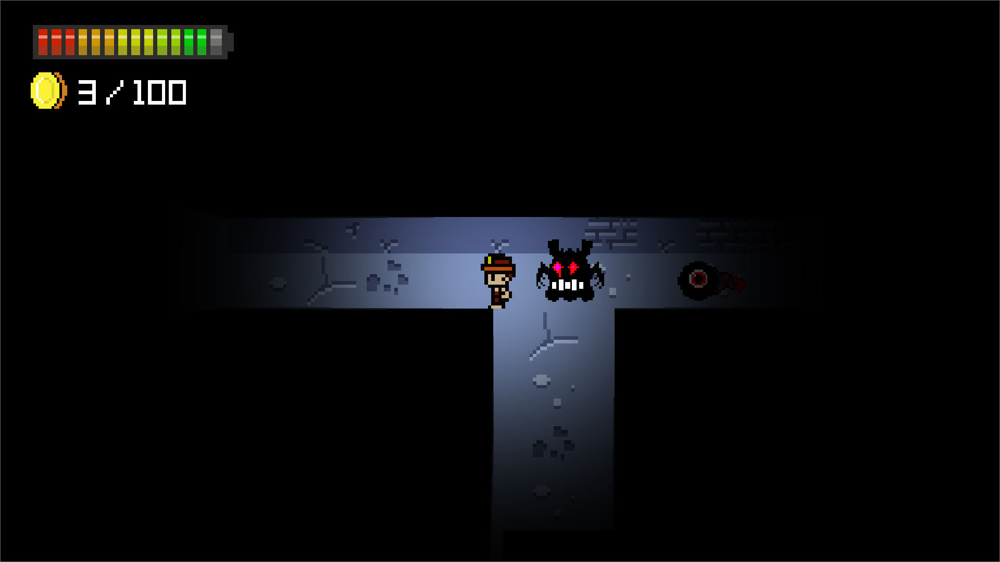

### 
 Introductory Session 

#### 
 Date: 09/10/2024  

#### 
 Speakers: Anush Bundel, Ashwin S, Vipin

#### GDU IIITK Games Catalogue
##### 1) [Dungeon Man](https://electrocubic.itch.io/dungeon-man)

Greetings, Brave Adventurer! You have finally decided to venture into The Dark Dungeons, where the Legendary Sword awaits its true conqueror! But beware the ghostly beings crawling throughout the twisty and narrow pathways in the depths of the Dark Dungeons... you cannot survive long without your flashlight. And also to assist you in your conquest of acquiring the Legendary Sword, you have been provided with a supernatural Radar to detect presence of such ghostly beings! Now get ready to have a adventure full of twists and turns, and of course lots of treasured coins!

Just Don't Drown in the Darkness... and Have Fun! :)

Our core team member `Anush Bundel` spent 2 months polishing, our `WTFxIGDC game jam` submission [Dungeon Man Old](https://bharathk33.itch.io/radar-game), made by our core team member `Anush Bundel, Bharath Krishnan, Gowrish I, Ashwin S`
Engine : Godot
Creator : Anush Bundel
Genre : Survial Horror