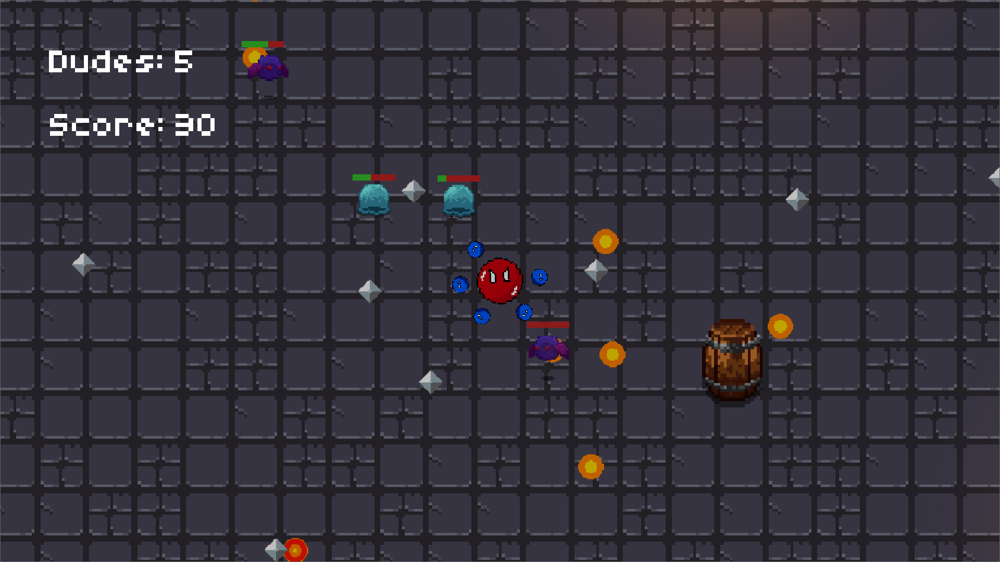

# 
Introductory Session 

#### Date: 09/10/2024 
#### Speakers: Anush Bundel, Ashwin S, Vipin

## GDU IIITK Games Catalogue
### 1) [Dungeon Man](https://electrocubic.itch.io/dungeon-man)

Greetings, Brave Adventurer! You have finally decided to venture into The Dark Dungeons, where the Legendary Sword awaits its true conqueror! But beware the ghostly beings crawling throughout the twisty and narrow pathways in the depths of the Dark Dungeons... you cannot survive long without your flashlight. And also to assist you in your conquest of acquiring the Legendary Sword, you have been provided with a supernatural Radar to detect presence of such ghostly beings! Now get ready to have a adventure full of twists and turns, and of course lots of treasured coins!

Just Don't Drown in the Darkness... and Have Fun! :)

Our core team member `Anush Bundel` spent 2 months polishing, our `WTFxIGDC game jam` submission [Dungeon Man Old](https://bharathk33.itch.io/radar-game), made by our core team member `Anush Bundel, Bharath Krishnan, Gowrish I, Ashwin S`
- Engine : Godot
- Creators : Anush Bundel
- Genre : Survial Horror

### 2) [Funky Blueprints](https://bharathk33.itch.io/funkyblueprints)

  </img>

The heart wants to be whole again but what perils shall lie in its path. The canvas is open and your imagination is the limit.

- Engine : Godot
- Creators : Anush Bundel, Gowrish I, Bharath Krishnan, Ankur Majumdar
- Genre : Puzzle, Physics

### 3) [MiniBrawlers](https://electrocubic.itch.io/mini-brawlers)

  </img>

Chaotic dudes trying to stay alive in a fast paced world of fiery death. One thing is for sure death is inevitable.

- Engine : Godot
- Creators : Anush Bundel
- Genre : Roguelike, Shooter, Arcade

### 4) [Wing It](https://bharathk33.itch.io/wingit)

  </img>

Bounce along as you try to escape the dangerous rocks falling with our young bird Bord (not a typo, please don't be bored).

- Engine : SDL2
- Creators : Bharath Krishnan, Gowrish I, Govind S, Pratyush Nanda
- Genre : Endless, Arcade 

### 5) [Dream Sequencer](https://electrocubic.itch.io/dream-sequencer)

  </img>

An Escape from Reality...
Put your platforming and puzzle-solving skills to the test with this literal mind-bending and tricky platformer which will try to trap you in the infinite abyss of the imaginary realm of Dreams. There are no locks or gates to be bound, yet the exit still doesn't seem to be found....?

Made during the GameVita 3.0 Game Jam hosted by GameDevUtopia. Made in 4 days in Godot Game Engine.

- Engine : Godot
- Creators : Anush Bundel , Ashwin S, Alex Gijo 
- Genre : Puzzle , Platformer 

### 5) [Duel](https://bharathk33.itch.io/duel)

  </img>

Job, Once a peaceful villager, he lived his days in harmony—until a curse from a wicked witch changed everything. Now, when night falls, he prowls the village, driven by an insatiable hunger for fresh blood. But his heart remains kind, and he refuses to let his friends become victims of his fate. So, each evening, as the sun sets, he fortifies his home, setting up barricades and defenses, doing everything he can to protect the people he loves from the monster he's become.

- Engine : Unity
- Creators : Bharath Krishnan, Krishna Narayan 
- Genre : Strategy

### 6) [The Cursed Frostbite](https://electrocubic.itch.io/the-cursed-frostbite)

  </img>

Job, Once a peaceful villager, he lived his days in harmony—until a curse from a wicked witch changed everything. Now, when night falls, he prowls the village, driven by an insatiable hunger for fresh blood. But his heart remains kind, and he refuses to let his friends become victims of his fate. So, each evening, as the sun sets, he fortifies his home, setting up barricades and defenses, doing everything he can to protect the people he loves from the monster he's become.

- Engine : Godot 
- Creators : Anush Bundel, Namit , Ashwin S
- Genre : Strategy

### 7) [Disarm It](https://bharathk33.itch.io/disarm-it)

  </img>

The notorious mad scientist, Dam, has trapped you in one of his twisted experiments. You're behind the wheel of a car that can never stop—if it does, you'll be blown to pieces. The rules of this deadly game are always changing, forcing you to adapt to each new twist, survive until the timer ticks to zero.

- Engine : Unity 
- Creators : Bharath Krishnan, Krishna Narayan 
- Genre : Platformer

### 8) [Space Slime Invasion](https://electrocubic.itch.io/space-slime-invasion)

  </img>

These slimes look harmless at first glance but their body is poisonous in nature and very lethal to a human being. The space shuttle activated its spike and saw defense mechanism to prevent the intruders from entering your space shuttle. But alas, the slimes remain unaffected by it. So in order to defend yourself, you have to reach the space shuttle's defense turret and defend against hoards of enemy spaceships attacking your space shuttle.

- Engine : Defold 
- Creators : Anush Bundel, Ashwin S 
- Genre : Platformer, Arcade Shooter