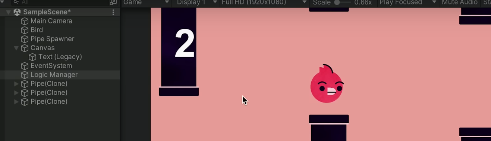

## [Unity Basic : Roll a Ball](https://learn.unity.com/project/roll-a-ball?uv=6)

### What you will learn
- Unity Editor basics
- How to move a ball from input
- Collect coins using your player
- Create basic UI
- AI that chases the player

## [Unity Basic : The Unity Tutorial For Complete Beginners by GMTK](https://www.youtube.com/watch?v=XtQMytORBmM)

### What you will learn
- A structured tutorial for beginners covering the basics of Unity
- A good starting point for beginners
- Provides general ideas to be used in all kinds of projects
- Learn game development using the well known flappy bird game

## [Unity Intermediate : Tanks](https://learn.unity.com/project/tanks-tutorial?uv=5.x)

### What you will learn
- Learn how to make a classic one keyboard PvP game 
- Covers Everything from Character Controller to Game Management
- Challenge : Try to add powerups and health pickups
- I highly recommend this tutorial after completing the basics, if you have a basic grasp over the unity editor.

## [Unity Intermediate : Complete 2D Platformer](https://www.youtube.com/watch?v=2pk1PPlS5Xs&list=PLgOEwFbvGm5o8hayFB6skAfa8Z-mw4dPV&index=15)

### What you will learn
- Build a Platformer Controller
- Covers Everything From Player Respawns to Pause Meny
- Learn how to handle spritesheets and tilemaps

## General Resources
### Basic General Resources 
- [Unity Learn - Hub of Unity Tutorials](https://learn.unity.com/)   
- [Unity Docs - Official Unity Documentation](https://docs.unity3d.com/Manual/index.html)
- [General : Brackeys - Mechanic Wise Videos](https://www.youtube.com/c/Brackeys)
- [General (More Artistic) : BlackThormProd - Best Resource for Unity 2D](https://www.youtube.com/@Blackthornprod)

### Intermediate Resources 
- [Book : Unity In Action](https://github.com/kurong00/GameProgramBooks/blob/master/05.Game%20Programming/Beginning%20Game%20Programming/From%20Unity/Unity%20In%20Action.pdf)
- [Intermediate to Advance : CatLikeCoding](https://catlikecoding.com/unity/tutorials/)

### Advanced Resources 
- [Advanced Unity : Sebastien-Lague](https://www.youtube.com/@SebastianLague)
- [Advanced Unity Programming : Git-Amend](https://www.youtube.com/@git-amend)
- [VFX Art : Gabriel Aguiar Prod](https://www.youtube.com/@GabrielAguiarProd/playlists)

# 
 Happy Learning 😊 

